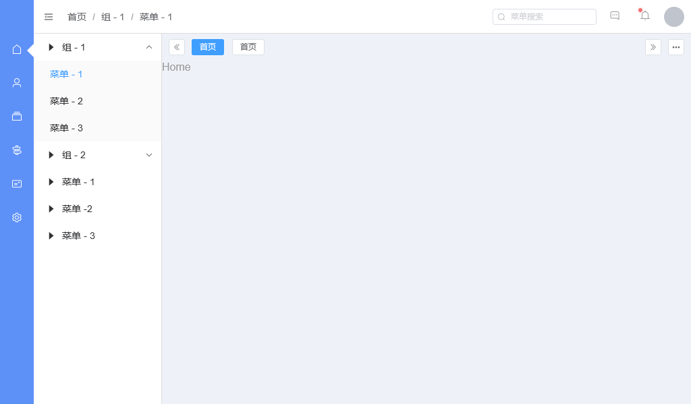

# NestJS Blog

用 [VueJs](https://cn.vuejs.org/) 框架搭建一个博客，尽可能的添加一些 ` 无用的代码 ` 并且让他运行起来。
> 这是一个前端服务，后端请切换分支

### 项目结构

```
src
├── public // 静态资源
├── admin，home // 后台，前端
|   ├── api // 接口
|   ├── layout // 布局
|   ├── router // 路由
|   ├── views // 页面
|   ├── sign // 登录页面
|   ├── erro // 错误页面
|   ├── main.ts // 入口
├── common // 共享内容
|   ├── api // 接口
|   ├── components // 组件
|   ├── directives // 指令
|   ├── layouts // 布局
|   ├── plugins // 插件
|   ├── stores // 状态管理
|   ├── utils // 工具
```

## 临时预览图


[](https://app.fossa.com/projects/git%2Bgithub.com%2FFunny002%2Fnest-vue-blog?ref=badge_shield)


## License
[](https://app.fossa.com/projects/git%2Bgithub.com%2FFunny002%2Fnest-vue-blog?ref=badge_large)